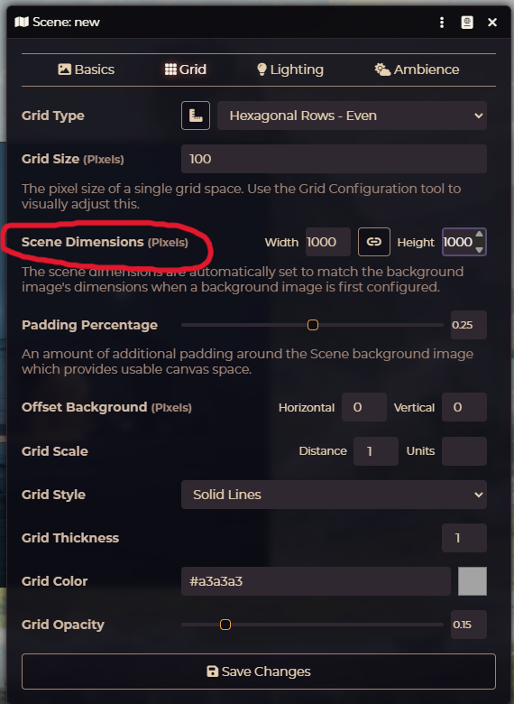
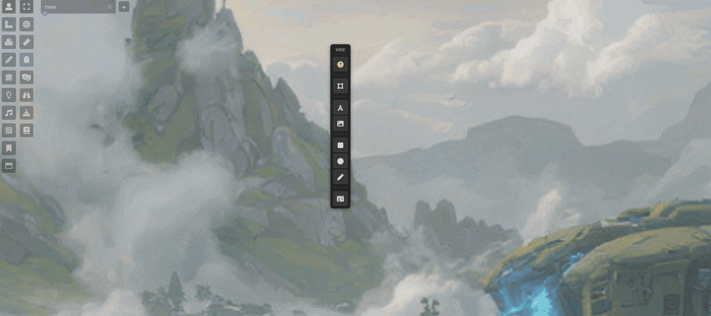
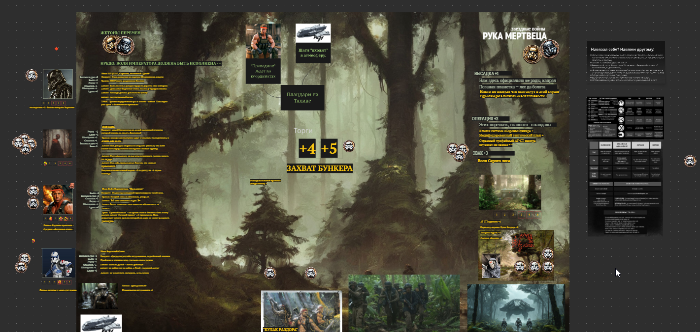
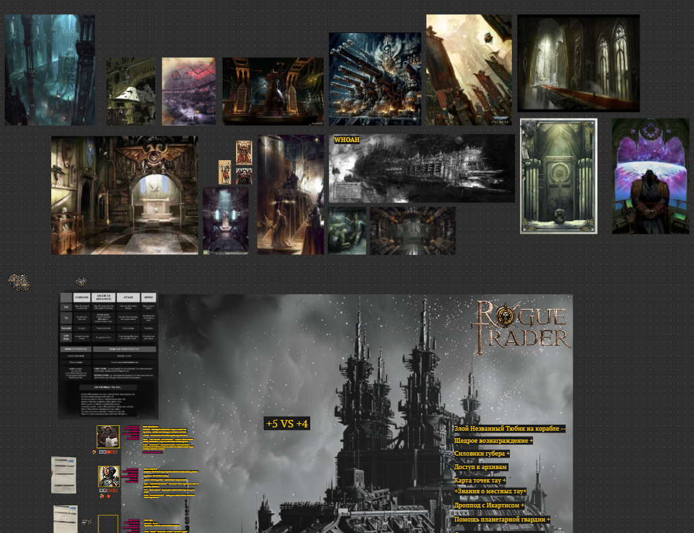
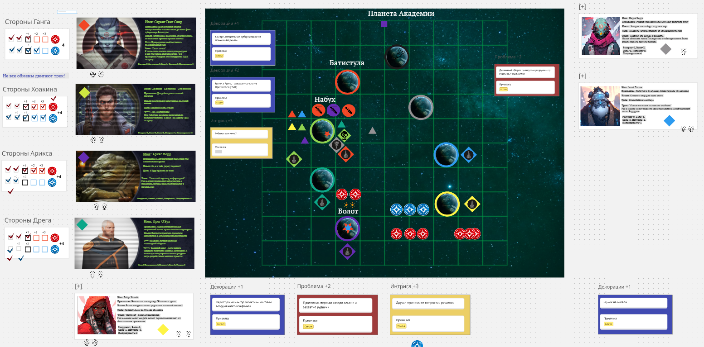

 
 

# Whiteboard Experience, Foundry11+

FoundryVTT module that provides whiteboard-style tools for images, text, shapes, and freehand drawing.

**Important:** WBE objects live in a layer ABOVE the standard Foundry canvas. They will overlay tokens, tiles, drawings, and other native VTT objects.

**Important:** Alpha version is tested MOSTLY for a single Foundry scene, if you have more then ONE scene on the table some issues may occur.

**Important:** Make it available for your players to add tokens / pictures in Foundry game settings, to make it really collaborative!

## Why This Plugin Exists

I love narrative games like Fate — light, collaborative, fast-paced. All I need is pretty dice, quick table setup, and everything visible to everyone.

Foundry is powerful but heavyweight, built for tactical grid combat and beautiful but cumbersome scenes. Simple collaborative layouts are trivially easy in whiteboard tools, but overkill in Foundry's UI.

So I built this: whiteboard vibes inside Foundry. Fast, lightweight, collaborative. Beautiful game tables in minutes.

## Scene Setup for Best Experience

For optimal zoom range and image quality, set your scene dimensions to large values (e.g., 10000x10000 or more). This allows to have online whiteboards "infinite table" experience with plenty of space to keep your game-scenes content.

**Important** Set up Foundry player settings to permit your players pasting images in the scene, if you want full collaboration

## Create Your First Table

The WBE toolbar can be placed anywhere you like — just drag it by the header.

I usually start with my table main background picture, place it and FREEZE it, so it won't move unnecessarily:

Then we can have a character for the mecha game there. I don't own the art, just took first one I liked from Google, and then deleted it, used just for the example.

So basically that's the whole idea: quick and somewhat "dirty" and you can do it together with your players. 
Create tables, write down your characters, notes, Fate Aspects, make tokens, draw freehand lines, shapes etc. Have fun!

## Table Examples

Some examples of tables that I've played, you can see that I keep the same idea and close-to-similar style, but you can go all crazy!

Click thumbnails to view full size:

## Features

### WBE Floating Toolbar
- Independent toolbar next to Foundry controls
- Draggable — grab the "WBE" header and move it anywhere
- Position persists between sessions
- Tools: Rectangle (`S`), Circle (`C`), Freehand (`F`), Text (`T`), Image paste, Multi-select

### Shapes (Rectangles & Circles)
- Create rectangles and circles directly on canvas
- Hotkeys: `S` — rectangle (square), `C` — circle
- Styling: fill color, border (color, width, style, radius), shadow
- Add texts to the shapes (double click them) and style it too
- Shadow with color, opacity, and X/Y offset controls
- Drag & resize with visual gizmo handles

### Freehand Drawing
- Draw freehand directly on canvas (`F`)
- Settings: color, stroke width, smoothing
- SVG-based — clean vector lines

### Text Objects
- Create text anywhere on the canvas (press `T`, then click; right click to disable)
- Rich text styling: font size, color, background, border, opacity
- Drag and resize with visual gizmo handles
- Copy/paste support

### Image Objects  
- Paste images directly from clipboard (`Ctrl+V`)
- Crop, scale, and position images
- Border and shadow styling (with X/Y offset)

### Mass Selection
- Select multiple objects at once (toggle in toolbar or `Shift+drag` on empty space)
- `Shift+Click` on object — add/remove from group
- Move, scale, rotate selected objects together
- Panel with rotation controls (slider, ±15° buttons, reset)
- Copy/paste and delete work on entire group

### Smart Alignment
- Alignment guides appear automatically while dragging
- Works for single objects and mass selection groups
- Snap to edges and centers of other objects
- Visual guides show matching boundaries
- Guides also work during shape and text resize

### Collaboration
- Real-time sync between players via sockets
- Persistent storage — objects survive page reload
- GM as a single source of truth server 
- Careful: if GM is not online your edits won't be stored!

### Styling
- Enhanced color picker with swatches and custom colors
- Shadow controls for all object types (shapes use SVG filters, images use CSS)
- Compact sliders for shadow opacity and X/Y offset
- Border subpanel with all border + shadow settings in one place

### Hotkeys
- `S` — Rectangle tool
- `C` — Circle tool  
- `F` — Freehand tool
- `T` — Text tool
- `Delete` — delete selected
- `PageUp/PageDown` — z-index control
- `Shift+PageUp/PageDown` — z-index jump (move to top/bottom)
- `Ctrl+C/V` — copy/paste
- `Shift+Click` — add/remove object from group
- `Shift+Drag` (empty space) — select multiple objects with box

### Other
- Z-index control (`PageUp`/`PageDown`)
- Lock objects to prevent accidental edits
- Freeze images from the style panel

## Compatibility
- Foundry VTT v11 - v13

## Installation

1. In Foundry, go to Add-on Modules → Install Module
2. Paste manifest URL: `https://raw.githubusercontent.com/rokunin/whiteboard-experience/main/module.json`
3. Enable the module in your world

## TODO
- [ ] Undo / Redo lib
- [ ] Vector Line Shape Tool
- [ ] Place DOM layer under Foundry Canvas option

## License

MIT

---

## Changelog

### v0.8.2

- **Help button** — added `i` icon in toolbar with tips modal (hotkeys, browser security info)
- **Bug fixes** — fixed drag sensitivity, Foundry UI click-through, line-height live update
- **Changes** — Fate Cards prototype disabled by default

### v0.8a.1

**New Features:**
- Added text creation and image paste icons to the WBE toolbar
- New resize gizmo for shapes and text objects — drag corner handles to resize visually
- Alignment guides now support shape and text resize operations

**Improvements:**
- Alignment guides are now always active — removed the `Ctrl` key requirement for simpler workflow

**Fixes:**
- First fix for image paste CORS issues

**Known Issues:**
- Text objects may jitter slightly during resize
- Selection frames may be slightly offset from objects

