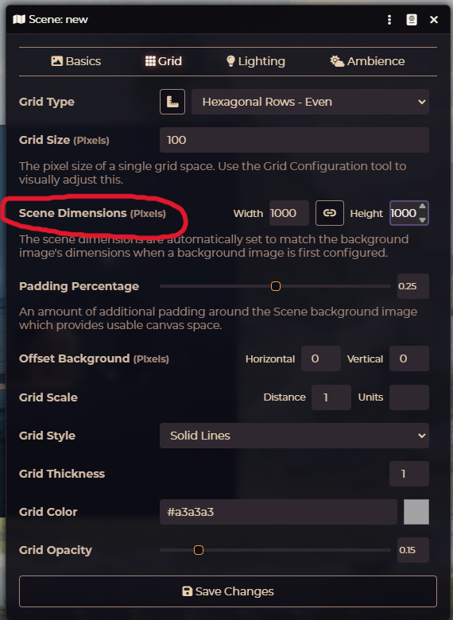
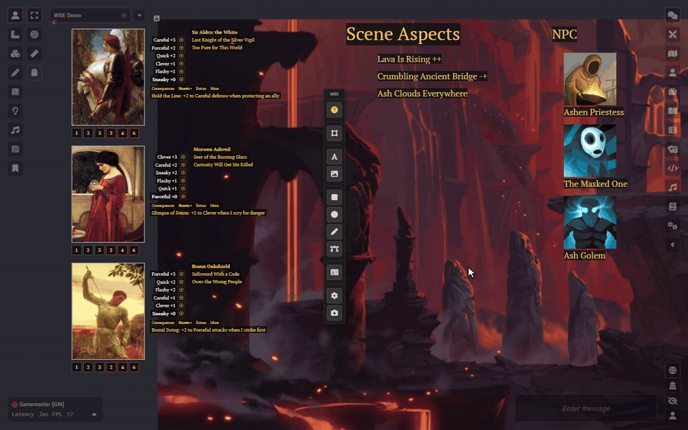
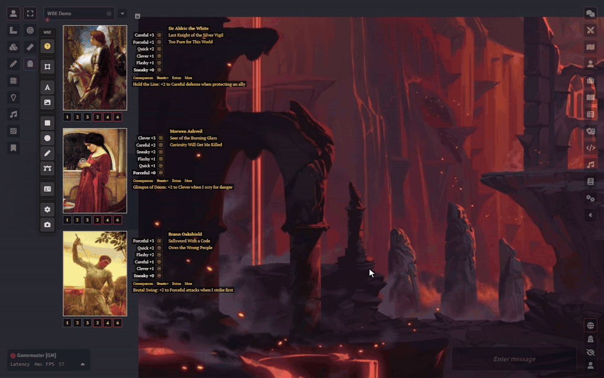
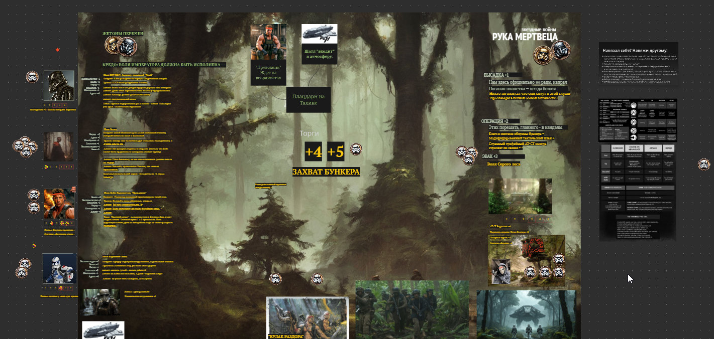
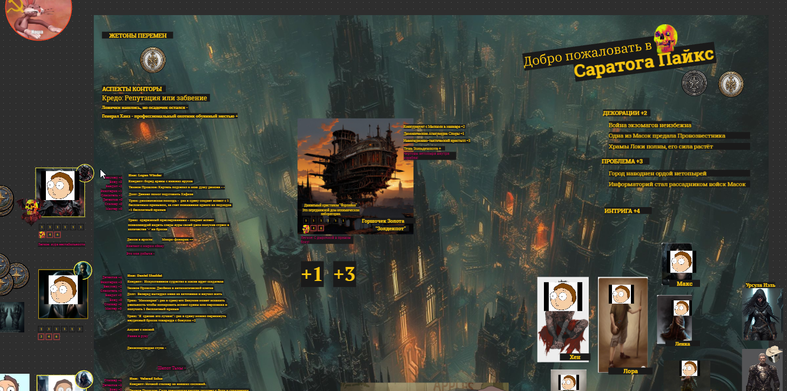
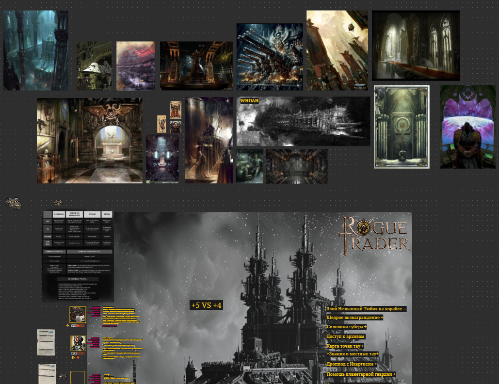
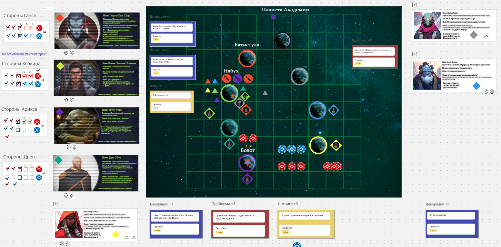

 
 

# Whiteboard Experience, Foundry11+

FoundryVTT module that provides whiteboard-style tools for images, text, shapes, and freehand drawing.

**Important:** WBE objects live in a layer ABOVE the standard Foundry canvas. They will overlay tokens, tiles, drawings, and other native VTT objects.

**Important:** The GM must be online — the GM client stores the board. If the GM is offline, edits won't be saved.

**Important:** Make it available for your players to add tokens / pictures in Foundry game settings, to make it really collaborative!

## Why This Plugin Exists

I love narrative games like Fate — light, collaborative, fast-paced. All I need is pretty dice, quick table setup, and everything visible to everyone.

Foundry is powerful but heavyweight, built for tactical grid combat and beautiful but cumbersome scenes. Simple collaborative layouts are trivially easy in whiteboard tools, but overkill in Foundry's UI.

So I built this: whiteboard vibes inside Foundry. Fast, lightweight, collaborative. Beautiful game tables in minutes.

## Scene Setup for Best Experience

For optimal zoom range and image quality, set your scene dimensions to large values (e.g., 10000x10000 or more). This allows to have online whiteboards "infinite table" experience with plenty of space to keep your game-scenes content.

**Important** Set up Foundry player settings to permit your players pasting images in the scene, if you want full collaboration

## Create Your First Table

The WBE toolbar can be placed anywhere you like — just drag it by the header.

I usually start with my table main background picture: paste it, stretch it over the screen and LOCK it, so it won't move unnecessarily:

Then the table fills up: player characters on the left (these are [Fate Card](https://foundryvtt.com/packages/fate-card) cards), NPC portraits pasted in one go and moved as a group, scene aspects written right on the table, and a roll straight from the card (with [Dice So Nice](https://foundryvtt.com/packages/dice-so-nice)):

So basically that's the whole idea: quick and somewhat "dirty" and you can do it together with your players. 
Create tables, write down your characters, notes, Fate Aspects, make tokens, draw freehand lines, shapes, connect things etc. Have fun!

Art in the GIFs: the background is from Foundry VTT's own assets; character portraits are public-domain paintings — G. F. Watts "Sir Galahad" (1862), J. W. Waterhouse "The Crystal Ball" (1902), F. Dicksee "Chivalry" (1885); NPC icons are from Foundry VTT's core icon set.

## Table Examples

Some examples of tables that I've played, you can see that I keep the same idea and close-to-similar style, but you can go all crazy!

Click thumbnails to view full size:

## Features

### WBE Floating Toolbar
- Independent toolbar next to Foundry controls
- Draggable — grab the "WBE" header and move it anywhere
- Position persists between sessions
- Tools: Rectangle (`S`), Circle (`C`), Freehand (`F`), Text (`T`), Image paste, Multi-select
- Settings (⚙, open to every user): collapse the toolbar down to its drag handle, ⚙, and any
  button a module opts in to keep visible (e.g. Fate Card's Add Card button); disable all WBE
  hotkeys; disable only the tool-activation hotkeys (`S`/`C`/`F`/`T`/`B`) while keeping object
  hotkeys (Delete, copy/paste, undo/redo, z-index) working. Each is a per-user setting that
  persists across reloads.

### Shapes (Rectangles & Circles)
- Create rectangles and circles directly on canvas
- Hotkeys: `S` — rectangle (square), `C` — circle
- Styling: fill color, border (color, width, style, radius), shadow
- Add texts to the shapes (double click them) and style it too
- Shadow with color, opacity, and X/Y offset controls
- Drag & resize with visual gizmo handles

### Freehand Drawing
- Draw freehand directly on canvas (`F`)
- Settings: color, stroke width, smoothing
- SVG-based — clean vector lines

### Text Objects
- Create text anywhere on the canvas (press `T`, then click; right click to disable)
- Rich text styling: font size, color, background, border, opacity
- Drag and resize with visual gizmo handles
- Copy/paste support

### Image Objects  
- Paste images directly from clipboard (`Ctrl+V`)
- Crop, scale, and position images
- Border and shadow styling (with X/Y offset)

### Mass Selection
- Select multiple objects at once (toggle in toolbar or `Shift+drag` on empty space)
- `Shift+Click` on object — add/remove from group
- Move, scale, rotate selected objects together
- Panel with rotation controls (slider, ±15° buttons, reset)
- Copy/paste and delete work on entire group

### Smart Alignment
- Alignment guides appear automatically while dragging
- Works for single objects and mass selection groups
- Snap to edges and centers of other objects
- Visual guides show matching boundaries
- Guides also work during shape and text resize
- Show/snap/release distances feel the same on screen at any canvas zoom, and a snapped guide
  doesn't flicker as you hold near a boundary
- Hidden objects are never a snap target

### Collaboration
- Real-time sync between players via sockets
- Persistent storage — objects survive page reload
- GM as a single source of truth server 
- Careful: if GM is not online your edits won't be stored!

### Styling
- Enhanced color picker with swatches and custom colors
- Shadow controls for all object types (shapes use SVG filters, images use CSS)
- Compact sliders for shadow opacity and X/Y offset
- Border subpanel with all border + shadow settings in one place

### Hotkeys
- `S` — Rectangle tool
- `C` — Circle tool  
- `F` — Freehand tool
- `T` — Text tool
- `B` — Connector tool
- `Delete` — delete selected
- `PageUp/PageDown` — z-index control
- `Shift+PageUp/PageDown` — z-index jump (move to top/bottom)
- `Ctrl+C/V` — copy/paste
- `Ctrl+Z` / `Ctrl+Shift+Z` — undo / redo
- Hold `Z` — see through the board to the Foundry canvas below
- `Shift+Click` — add/remove object from group
- `Shift+Drag` (empty space) — select multiple objects with box
- Per-user settings (toolbar ⚙) can disable all of these, or just the tool-activation ones
  (`S`/`C`/`F`/`T`/`B`) while keeping Delete/copy/paste/undo/redo/z-index working

### Connectors
- Curved lines between two objects (`B`)
- They follow the objects when you move them
- Bend a connector by dragging its middle point

### GM Tools
- Hide From Players: hidden objects are invisible to players and click-through for them
- "Create objects as hidden" option in the toolbar settings (⚙)

### Other
- Undo / redo for everything on the board (`Ctrl+Z` / `Ctrl+Shift+Z`)
- Z-index control (`PageUp`/`PageDown`)
- Lock objects to prevent accidental edits
- Freeze images from the style panel
- Add-on objects: other modules can put their own objects on the board — [Fate Card](https://foundryvtt.com/packages/fate-card) is the first one

## Compatibility
- Foundry VTT v11 to v14

## Installation

1. In Foundry, go to Add-on Modules → Install Module
2. Paste manifest URL: `https://raw.githubusercontent.com/rokunin/whiteboard-experience/main/module.json`
3. Enable the module in your world

## TODO
- [ ] Vector Line Shape Tool
- [ ] Place DOM layer under Foundry Canvas option

## License

MIT

---

## Changelog

### v0.9.3

**New**
- An arrow button at the top of the toolbar. It is lit while no tool is on, so you can always see whether you are still drawing, placing shapes, connecting or adding text. Click it (or press V) to put the tool down. Right click, clicking the tool again and its own key still work too.
- The toolbar can lie flat. The button next to ⚙ switches it between a column and a row, and every player picks this for themselves.
- Double-click the WBE handle to fold the toolbar away, and again to bring it back. Same as the checkbox in ⚙.

**Changed**
- Texts now work like in Miro. A text you never resized grows with its content: make the font bigger and the text gets wider instead of wrapping. Once you drag a text's side handle, its width stays where you put it and the text wraps inside it. Texts from earlier versions are sorted out the first time you change them: a one-line label becomes a growing one, a paragraph that already wraps keeps its width.

**Fixed**
- Rotating a group, clicking away, selecting it again and pressing reset (0°) no longer scatters it. When the selected objects share one angle, the rotation panel shows it, and reset puts the layout back as it was before the rotation, also after a reload or after the group was moved. Reset also gives every object back its own angle (it used to set them all to 0).
- Making a text's font smaller shrinks its box right away. Before, the box kept the old height until a reload, so the same text could have a different frame on another player's screen.
- Toolbar buttons show one tooltip, not two, and it names the key: "Create Text (T)", "Rectangle (S)". The rectangle tooltip used to say R, but its key has always been S. If you turned tool keys off in ⚙, the tooltips leave the key out.
- The "GM is not online" banner no longer blocks clicks on whatever is under it, such as the toolbar handle.
- While editing a text, the fields and lists in the style panel (size, line spacing, opacity) work. Before, clicking the size field sent you straight back into the text, so the digits you typed ended up in the text and the lists closed at once. The part of the text you had selected stays selected, so Bold and Italic still apply to it.
- A long word in a text with a set width no longer gets cut off after you finish editing. It wraps the same way it does while editing.
- With more than one GM in the game, changes on a scene are saved even when the main GM is looking at another scene. Before, only the main GM saved, so objects made on a scene they were not viewing could be lost on reload.

### v0.9.2

**Fixed**
- Rotating a group of selected objects is one step for undo now. Before, Ctrl+Z took the group apart one object at a time. The rotate panel also stays where it is while you click it.
- Ctrl+Z no longer spends a press on "changes" that changed nothing.
- The blue selection frame follows an object when it changes size: a Fate card switching edit mode, a picture that finishes loading, a text that grows as you type. Before, the frame kept the old size until something else refreshed it.

### v0.9.1

Mostly groundwork for the new [Fate Card](https://github.com/rokunin/wbe-fate-card) module, plus a few things that bugged me.

**New**
- You can fold the toolbar away. In the toolbar settings (⚙) there are three checkboxes: collapse the toolbar down to its handle and the settings button, turn off all WBE hotkeys, or turn off only the tool keys (S, C, F, T, B). Useful if you mostly use the board for cards and keep making shapes by accident while typing. Every player sets this for themselves.
- Other modules can now put their own objects on the board. Fate Card is the first one. If you want to build your own, the [Fate Card source](https://github.com/rokunin/wbe-fate-card) is the reference for now — ask on Discord if you get stuck.

**Fixed**
- Alignment guides snap at the same distance on screen, whatever the zoom. Before, they almost never kicked in when you were zoomed out and grabbed too eagerly when zoomed in. They also stopped flickering at the edge of the snap zone, and they ignore hidden objects.
- Objects created by someone else in the first second after you joined could stay invisible to you until a reload.
- Mass scaling no longer resizes objects that are not supposed to be scaled.

### v0.9.0

**New**
- Undo and redo for everything on the board: Ctrl+Z and Ctrl+Shift+Z.
- Connectors (B): curved lines between two objects. They follow the objects when you move them, and you can bend them by dragging the middle point.
- Hide From Players: GMs can hide any object. Players don't see it and click straight through it.
- Hold `Z` to see through the board at 20% opacity, so you can find Foundry tokens or tiles hidden underneath it. Objects stay put while you do this.
- Only one person can edit a text at a time. If someone else is typing in it, you get a message instead of both edits fighting.
- Debug snapshot button on the toolbar: saves the board state to a file you can attach to a bug report.

**Fixed**
- Crop handles stay on the edges of the image after you drag them or zoom the canvas, and keep their size.
- Text objects no longer throw errors while resizing.
- Lots of smaller fixes.

**Changed**
- Tested on Foundry v14. Still works from v11.

**Known issues**
- Shift+Enter while editing text adds an extra blank line to the saved text.
- Clicking the Crop button a second time does not leave crop mode. Click outside the image instead.
- Ctrl+Z right after dragging a crop handle does not undo the crop.
- Creating an object and switching scenes within about 300 ms of each other can lose that object. Workaround: wait a moment after creating something before you change scenes.
- If the GM hides an object at the same moment a player is dragging it, the hide can be lost. Workaround: avoid hiding an object while someone else is actively moving it.
- Rare: a GM undo at the same moment a player edits a different field on the same object can overwrite the player's change. Hard to reproduce consistently.

### v0.8.2

- **Help button** — added `i` icon in toolbar with tips modal (hotkeys, browser security info)
- **Bug fixes** — fixed drag sensitivity, Foundry UI click-through, line-height live update
- **Changes** — Fate Cards prototype disabled by default

### v0.8a.1

**New Features:**
- Added text creation and image paste icons to the WBE toolbar
- New resize gizmo for shapes and text objects — drag corner handles to resize visually
- Alignment guides now support shape and text resize operations

**Improvements:**
- Alignment guides are now always active — removed the `Ctrl` key requirement for simpler workflow

**Fixes:**
- First fix for image paste CORS issues

**Known Issues:**
- Text objects may jitter slightly during resize
- Selection frames may be slightly offset from objects

